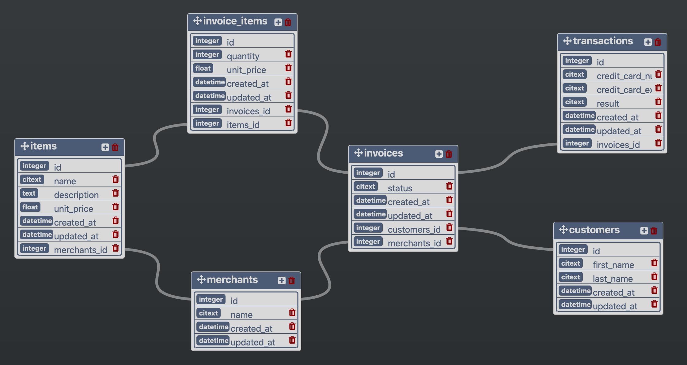

# Rails Engine README

Rails Engine is a Ruby on Rails JSON API that exposes Sales Engine data from six csv files.

Note: this was built with Rails 5.2.3 and Ruby 2.4.1

## Setup

To run Rails Engine, do the following:

* Fork and clone down the repo.

* Run `bundle install` from the project directory to install all needed gem files.

* Create and build the database using `rails db:create` and `rails db:migrate`.

* Import six csv files using `rake csv_import`. This runs a custom rake task located in `/lib/tasks/import.rake`. The csv files are located in `/db/import`. They include: customers, invoice_items, invoices, items, merchants, and transactions. Note that importing will take some time (~ 2 minutes).

* Run `rails s` to start the server.

## Running Tests

Tests were created using RSpec and are located in `/spec`. There are two types of tests: model and requests. Model tests are located in `/spec/models` and request tests are located in `/spec/requests/api/v1`. Future tests may be in a different version folder (e.g. v2).

If RSpec is installed, you can run all tests using the `rspec` command. For a specific test file, use `rspec ./path_to_file.rb`. For a specific test in a specific file, use `rspec ./path_to_file.rb:line_number` (e.g. `rspec ./requests/api/v1/customer_relationship_spec.rb:24`).

## Database Organization

## Attributes

* Customers

    * `id`

    * `first_name`

    * `last_name`

    * `created_at`

    * `updated_at`

* Invoice Items

    * `id`

    * `quantity`

    * `unit_price`

    * `created_at`

    * `updated_at`

    * `invoice_id`

    * `item_id`

* Invoices

    * `id`

    * `status`

    * `created_at`

    * `updated_at`

    * `customer_id`

    * `merchant_id`

* Items

    * `id`

    * `name`

    * `description`

    * `unit_price`

    * `created_at`

    * `updated_at`

    * `merchant_id`

* Merchants

    * `id`

    * `name`

    * `created_at`

    * `updated_at`

* Transactions

    * `id`

    * `credit_card_number`

    * `credit_card_expiration_date`

    * `result`

    * `created_at`

    * `updated_at`

    * `invoice_id`

## Available Requests

Note: all requests are prefixed with `localhost:3000/api/v1`. See attributes above for available query parameters.

* Customers

    * `/customers` - list of all customers

    * `/customers/:id` - specific customer

    * `/find` - find a specific customer using query parameters (e.g. `/find?first_name=Joey`)

    * `/find_all` - find multiple customers using query parameters

    * `/random` - return a random customer

    * `/:id/invoices` - return all invoices associated with a specific customer

    * `/:id/transactions` - return all transactions associated with a specific customer

* Invoice Items

    * `/invoice_items` - list of all invoice items

    * `/invoice_items/:id` - specific invoice item

    * `/find` - find a specific invoice item using query parameters (e.g. `/find?quantity=5`)

    * `/find_all` - find multiple invoice items using query parameters

    * `/random` - return a random invoice item

    * `/:id/invoice` - return associated invoice for a specific invoice item

    * `/:id/item` - return associated item for a specific invoice item

* Invoices

    * `/invoices` - list of all invoices

    * `/invoices/:id` - specific invoice

    * `/find` - find a specific invoice using query parameters (e.g. `/find?status=shipped`)

    * `/find_all` - find multiple invoices using query parameters

    * `/random` - return a random invoice

    * `/:id/transactions` - return all transactions associated with a specific invoice

    * `/:id/invoice_items` - return all invoice_items associated with a specific invoice

    * `/:id/items` - return all items associated with a specific invoice

    * `/:id/customer` - return associated customer for a specific invoice

    * `/:id/merchant` - return associated merchant for a specific invoice

* Items

    * `/items` - list of all items

    * `/items/:id` - specific item

    * `/find` - find a specific item using query parameters (e.g. `/find?name=Nemo Facere`)

    * `/find_all` - find multiple items using query parameters

    * `/random` - return a random item

    * `/:id/invoice_items` - return all invoice_items associated with a specific item

    * `/:id/merchant` - return associated merchant for a specific item

* Merchants

    * `/merchants` - list of all merchants

    * `/merchants/:id` - specific merchant

    * `/find` - find a specific merchant using query parameters (e.g. `/find?name=Williamson Group`)

    * `/find_all` - find multiple merchants using query parameters

    * `/random` - return a random merchant

    * `/:id/items` - return all items associated with a specific merchant

    * `/:id/invoices` - return all invoices associated with a specific merchant

    * `/:id/most_revenue?quantity=x` - return `x` number of merchants ranked by total revenue

    * `/:id/revenue?date=x` - return the total revenue for date `x` across all merchants

* Transactions

    * `/transactions` - list of all transactions

    * `/transactions/:id` - specific transaction

    * `/find` - find a specific transaction using query parameters (e.g. `/find?result=success`)

    * `/find_all` - find multiple transactions using query parameters

    * `/random` - return a random transaction

    * `/:id/invoice` - return associated invoice for a specific transaction
